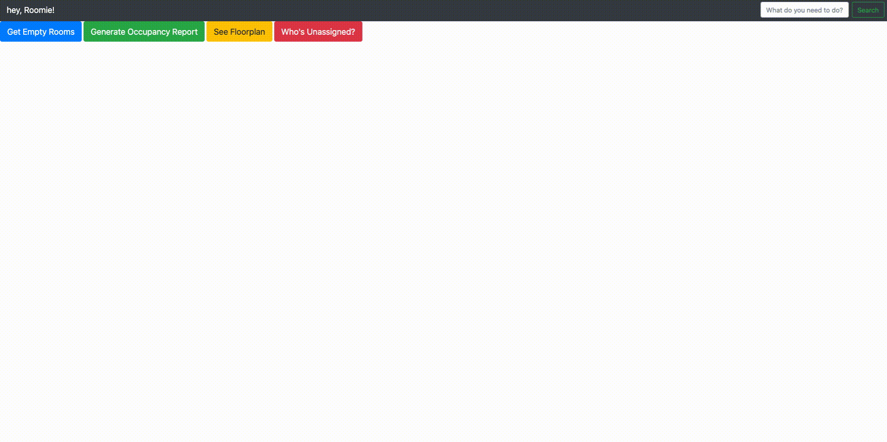

# hey, Roomie!



An app to help you assess, maintain, and assign dorm rooms.  This can help your team:

<!-- - Check each room for maintenance issues and assessing for size (can 2 people fit in here?), -->
<!-- - Report any maintenance issues with the room, -->
<!-- - Record key codes for each room, -->
- Assign participants to a room(s) for the duration of their stay,
<!-- - Print a list of rooms needing linens by day, -->
<!-- - Print a list of rooms needing furniture changes (beds raised/lowered, items borrowed from another room and when/where to return them), -->
<!-- - Record what key code they have been given, and how they have paid their key deposit (if applicable), -->
<!-- - Record any internal information about their stay (locks self out every night, left a mess, etc.), -->
- List which rooms are unassigned each night, so that last minute arrivals can be managed,
- List which participants remain unassigned, and show their room preferences and your own notes about them,
<!-- - Display a calendar of arrivals/departures, -->
- Submit nightly occupancy reports via email.

## You will need:

- Floorplans for each floor you plan to use, in .pdf and sent to the app owner two weeks before event move-in,
- Files of user information, in .csv, sent to the app owner one week before event move-in,
- Web-enabled devices,
- A login verified with the app owner.

## Technology

MySql
Node Express
React Bootstrap

## Installation

Set this up in CLI:
```bash
npm run start
npm run watch
```

(See Schema.sql file (bottom) to get database set up correctly.)

## Contributing
Pull requests are welcome. For major changes, please open an issue first to discuss what you would like to change.

## Author

Cayla Cardiff
